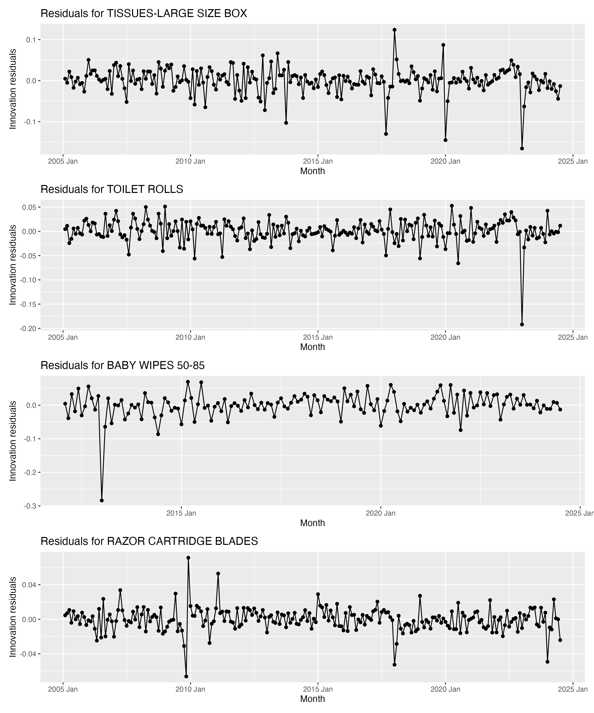
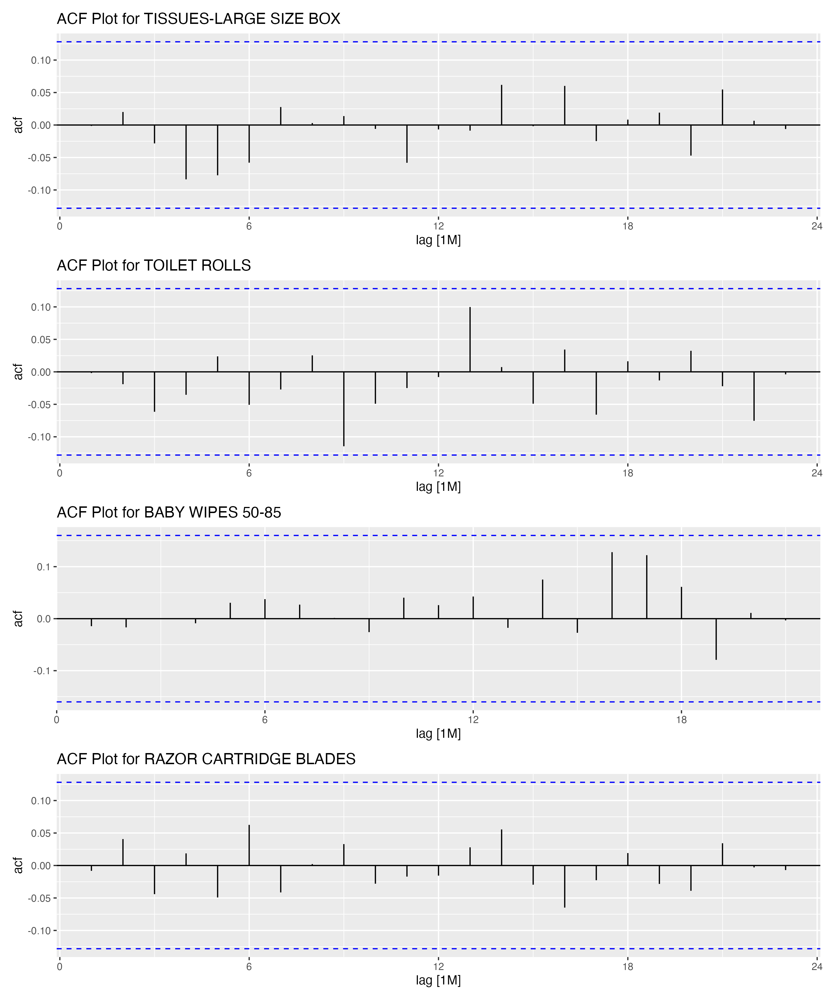

# Introduction

```{r setup, include=FALSE}
knitr::read_chunk("Script.R")
library(tidyverse)
library(lubridate)
library(ggplot2)
library(tsibble)
library(fable)
library(feasts)
library(tseries)
library(patchwork)
library(kableExtra)
```

On January 1, 2021, the United Kingdom abolished the 5% VAT on women's sanitary products, commonly known as the "tampon tax." Economic theory generally predicts that tax cuts lead to price decreases, but the extent of this effect depends on various factors such as demand elasticity. In the case of the UK tampon tax abolition, there has been considerable debate regarding its actual impact on consumer prices.

@neidle2022 is one prominent study that appeared to find that the tax removal did not result in a price decrease. However, the study suffers from significant methodological shortcomings:

1.  It assumes independent data points for inference, an unrealistic assumption for time series price data.

2.  It fails to account for the methodology used by the Office for National Statistics (ONS) in calculating consumer price indices (CPI).

This report aims to address these methodological challenges and provide a more robust analysis of the tampon tax abolition's impact on consumer prices by employing an event study methodology utilizing time series techniques, incorporating the nuances of the ONS price index calculations, and conducting robustness checks.

# Empirical Strategy

As mentioned in the introduction, the strategy employed in this analysis is an event study using time series methods. The model equation is

$$
y_t = \beta_0 + \beta_1 T + \eta_t
$$

where $y_t$ is the natural log of the individual price index for tampons, $T$ is a dummy equal to 1 after the abolition of the tampon tax, and $\eta_t$ is an ARIMA error term that captures the time series properties of the data.

The identifying assumption of this approach is that, after accounting for the tampon tax abolition and incorporating time effects through ARIMA errors, there are no other significant, sudden shocks to prices. To validate this assumption, the same empirical strategy will be applied to several related goods, serving as a robustness check for the results.

To choose what parameters to use for the ARIMA errors, the `fable` package in R provides an automated process. The specific ARIMA model will be reported in the results.

# Data 

Data for this analysis comes from the ONS website https://www.ons.gov.uk/economy. 

A crucial aspect of the ONS data that needs to be dealt with is the way the ONS calculates individual price indices. Effectively, individual price indices are rebased using last January's price index every year. The effect of this procedure can be seen in the section of the data below.

```{r Table for Rebase Example, echo=FALSE}
```

Notice that the price index has significant jumps when transitioning from January to February. To account for this, the price indices for tampons will be rebased to 2005 for this analysis. The other products to be analyzed will be rebased to the earliest year available in their respective datasets.

# Results

First, a plot of the autocorrelation function (ACF) up to 48 months for the tampon data is shown below.

```{r Analysis, include=FALSE}
```

```{r ACF Plot, echo=FALSE}
```

There is a very clear autocorrelation in price, so the methodology of @neidle2022 is indeed problematic.

The results of regression with ARIMA errors are displayed in the table below. `fable` chose ARIMA$(1,1,2)(0,0,2)_{12}$ to model the errors.

```{r Tampon Analysis Table, echo=FALSE}
```

As the dependent variable is the natural log of the price index, the coefficient can be interpreted as an approximate percentage change. Thus, the results suggest a roughly 4% decrease in price following the abolition of the tampon tax. To check whether the estimated model is a good fit, a plot of the residuals against the fitted values along with a plot of the ACF of the residuals are shown.

```{r Tampon Resid Graphs, echo=FALSE}
```

For the most part, the ACF graph indicates that the model has accounted for most of the autocorrelation. The plot of residuals over time also suggests that the errors are likely homoskedastic -- aside from a few outliers, the residuals do not appear to have a changing variance. The standard errors can be trusted as a result.

A plot of the price index over time is also displayed below. A noticeable jump can be seen at the time where the tampon tax was abolished.

```{r Tampon Price Graph, echo=FALSE}
```

# Robustness Check

Recall that the key assumption underlying the methodology of this analysis is that the observed price drop is attributable solely to the tax change after accounting for the impact of time. To test whether another event that suddenly dropped prices may have occurred at the same time as the abolition of the tampon tax, the same methodology used for tampons is applied to several related goods — tissues, toilet rolls, baby wipes, and razor cartridges^[@neidle2022 looked at a total of 13 other goods. For brevity, only four are analyzed in this report.]. 

The results are reported in the table below.

```{r Robustness Check, echo=FALSE}
```

```{r Robustness Check Table, echo=FALSE}
```

None of the other goods appear to have had a significant change in price at the time of the tax abolition. To check that the estimated models are appropriate, residual graphs and ACFs are also shown.

```{r, echo=FALSE}


```

The residual plots reveal a few outliers and indicate heteroskedasticity in the price indices for razor blades and tissues. Heteroskedasticity often leads to an underestimation of standard errors, which can cause insignificant effects to appear significant. Therefore, the p-values for tissues and razor blades are likely underestimated. This provides more confirmation that the negative estimate for tissues does not provide evidence of a price drop beyond what is explained by the tampon tax abolition. Additionally, the ACF plots indicate that the ARIMA errors have effectively captured the autocorrelation in the price data.

\newpage

# References
